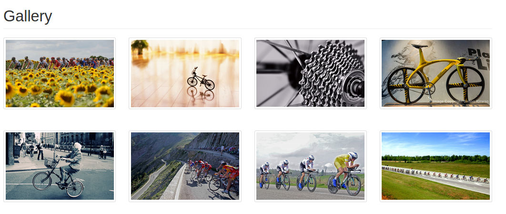

# gallery

Exemplo de projeto Django para upload e download de arquivos.

## Este projeto foi feito com:

* [Django 3.1.7](https://www.djangoproject.com/)

## Como rodar o projeto?

* Clone esse repositório.
* Crie um virtualenv com Python 3.
* Ative o virtualenv.
* Instale as dependências.
* Rode as migrações.

```
git clone https://github.com/rg3915/gallery.git
cd gallery
python3 -m venv .venv
source .venv/bin/activate
pip install -r requirements.txt
python contrib/env_gen.py
python manage.py migrate
```

## Screenshot




## Links

https://cloudinary.com

https://pypi.org/project/django-cloudinary-storage/

https://ccbv.co.uk/projects/Django/3.1/django.views.generic.edit/CreateView/

https://docs.djangoproject.com/en/3.0/ref/clickjacking/#setting-x-frame-options-for-all-responses

